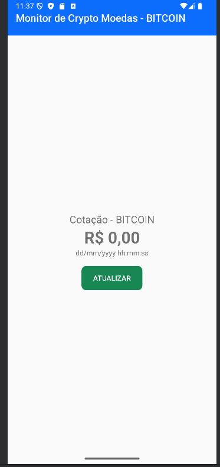
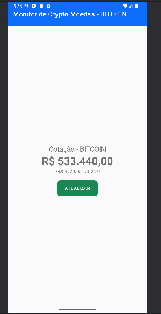

# Crypto App

Este projeto é um aplicativo Android simples para **consultar informações de criptomoedas** em tempo real, consumindo a API pública do Mercado Bitcoin.

---

## Estrutura do Código

O projeto é dividido principalmente em três pacotes: `service`, `model` e a `MainActivity`.

### 📂 service

O pacote `service` é responsável por **definir a comunicação com a API de criptomoedas**.

- **MercadoBitcoinService.kt**
    - Essa é uma interface para o Retrofit. Ela define como o app Android vai se comunicar com a API do Mercado Bitcoin para buscar informações sobre o preço do Bitcoin.
    - Define a interface para a comunicação com o backend usando Retrofit.
    - Contém a requisição `@GET("public/cryptocurrencies/list")` para buscar a lista de moedas.


- **MercadoBitcoinServiceFactory.kt**
    - Responsável por configurar o **Retrofit** (biblioteca para consumir APIs REST).
    - Adiciona um conversor Gson para transformar automaticamente as respostas JSON em objetos Kotlin.
    - Cria e entrega uma instância pronta de MercadoBitcoinService, permitindo realizar chamadas de API de maneira fácil.
    - Define a URL base e gera a instância que será usada para fazer as requisições HTTP.

### 📂 model

O pacote `model` contém as **classes de dados** (também chamadas de "models" ou "DTOs") que representam as informações da API.

- **TickerResponse.kt**
    - A classe representa o objeto completo que a API retorna.
    - Guarda o objeto Ticker que vem da resposta da API.

- **Ticker.kt**
    - Classe de dados (modelo principal)
    - Representa os dados reais sobre o Bitcoin que você quer usar no app.
  
### 📂 main (MainActivity.java)

- **MainActivity.kt**
    - É a **tela principal** do aplicativo.
    - Responsável por:
        - Inicializar a interface (carregar layout, toolbar).
        - Configurar a RecyclerView para mostrar a lista de criptomoedas.
        - Chamar o serviço da API para buscar os dados.
        - Atualizar a interface com a lista de moedas recebidas.

---

## Tecnologias Usadas

- **Kotlin** para a lógica do app.
- **Android Studio** como ambiente de desenvolvimento.
- **Retrofit** para fazer requisições HTTP de maneira simples.
- **RecyclerView** para exibir listas de maneira eficiente.
- **Material Design** para componentes visuais (Toolbar, etc).

---

## Evidência do projeto executando






---

## Como rodar o projeto

1. Clone o repositório:
   ```bash
   git clone https://github.com/Viihcerq/crypto.git
   ```

2. Abra o projeto no **Android Studio**.

3. Instale as dependências necessárias (o Gradle fará isso automaticamente).

4. Configure um emulador Android ou conecte um dispositivo físico.

5. Rode o aplicativo (`Run > Run 'app'`).


