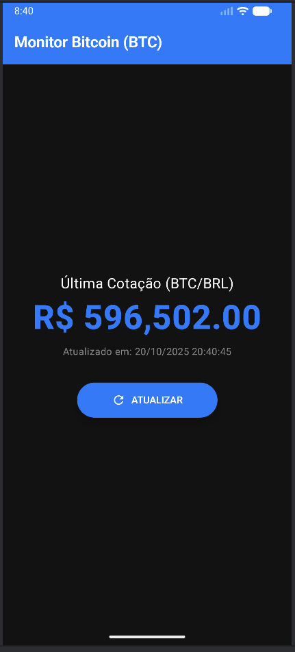

Este projeto é um aplicativo Android moderno, totalmente refatorado para o paradigma declarativo **Jetpack Compose**. O objetivo é consultar a cotação do **Bitcoin (BTC/BRL)** em tempo real, consumindo a API pública do **Mercado Bitcoin**.

A migração completa removeu todos os layouts XML e adotou a arquitetura reativa moderna do Android.

---

## 🚀 Novas Funcionalidades e Arquitetura

O projeto foi totalmente refatorado para o padrão declarativo, implementando:

### Interface de Usuário Declarativa (Jetpack Compose / Material 3)
- Toda a UI (Toolbar, informações da cotação, botão) é construída com funções Kotlin *Composable*, sem o uso de arquivos XML.
- Utiliza um tema escuro customizado para um visual moderno.

### Arquitetura MVVM Reativa
- Segue o padrão **Model-View-ViewModel (MVVM)** para separação clara de responsabilidades.
- O fluxo de dados é unidirecional, tornando o estado da aplicação mais previsível.

### Gerenciamento de Estado com Kotlin Flow
- O **CryptoViewModel** gerencia o estado da tela (Loading, Success, Error).
- A UI observa esse estado reativamente usando **StateFlow** e **collectAsState()**, garantindo que a tela seja atualizada automaticamente com os dados da API.

---

## 📂 Estrutura do Código

A estrutura do projeto foi organizada em pacotes lógicos, seguindo o **Clean Code** para as camadas de Dados e Apresentação:

### 1. Camada de Dados (`data`)
Responsável pela origem dos dados (API).

**data.model** (`TickerResponse.kt`, `Ticker.kt`):  
Classes de dados Kotlin que mapeiam a resposta JSON da API.

**data.service** (`MercadoBitcoinService.kt`, `MercadoBitcoinServiceFactory.kt`):  
Interface Retrofit para a requisição `api/BTC/ticker/`.  
Factory para configurar e instanciar o Retrofit, utilizando a URL base `https://www.mercadobitcoin.net/`.

### 2. Camada de Apresentação (`presentation`)
Responsável pela lógica da UI e pela exibição reativa.

**presentation.viewmodel** (`CryptoViewModel.kt`, `CryptoUiState.kt`):  
Contém a lógica de negócio (buscar dados, formatar moeda/tempo) e expõe o estado da UI via `StateFlow`.

**presentation.screen** (`CryptoScreen.kt`):  
Contém todas as funções *Composable* (`CryptoApp`, `CryptoScreen`, `QuoteInformation`, etc.) que desenham a interface final.

---

## 🛠️ Tecnologias Usadas

- **Kotlin** — Linguagem principal.
- **Jetpack Compose** — Framework de UI Declarativa.
- **Material Design 3** — Componentes visuais modernos.
- **Architecture Components (ViewModel & Coroutines)** — Gerenciamento de ciclo de vida e concorrência.
- **Kotlin Flow / StateFlow** — Reatividade e gerenciamento de estado.
- **Retrofit & OkHttp** — Comunicação de rede.

---

## 🖥️ Como Rodar o Projeto

1. Clone o repositório:

   ```bash
   git clone https://github.com/Viihcerq/crypto.git


---

## Evidência do projeto executando


---


